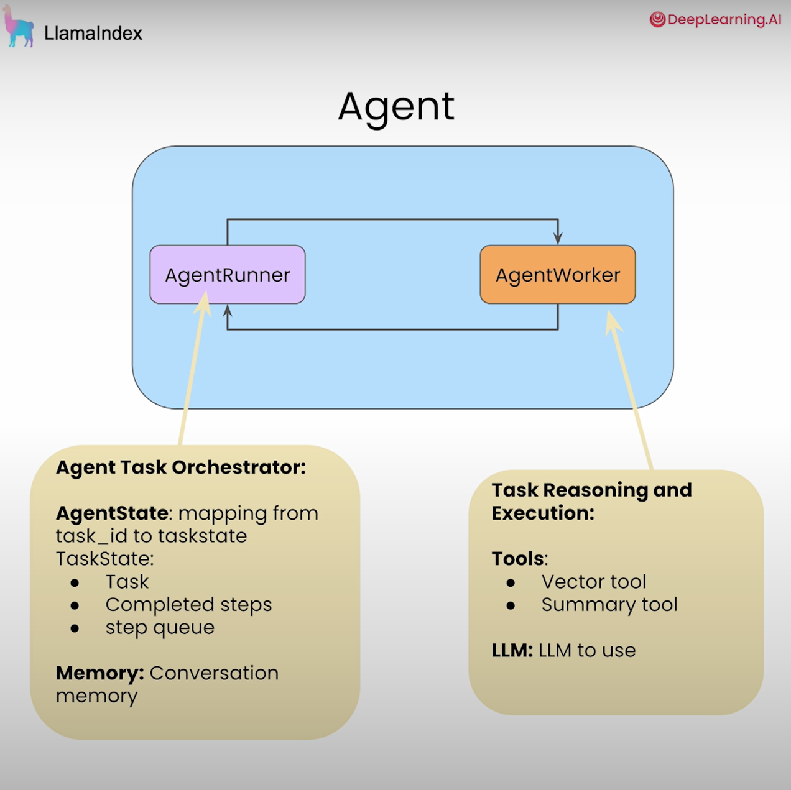
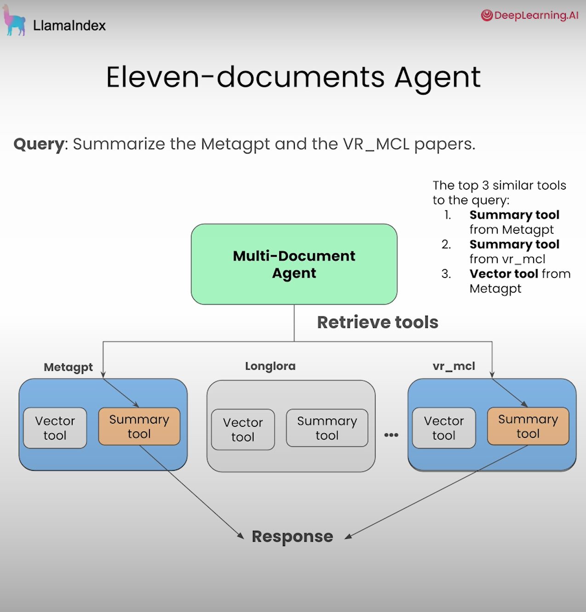

# Agentic-RAG-with-LlamaIndex

This is my code and study overview for the project Building Agentic RAG with LlamaIndex.  

# ✅ Topic 1. Tools Calling using a Router Engine

* The primary role of LLM within standard RAG systems involves synthesizing information.
* The router engine provides extra capabilities that allow LLM to choose between executing a Q&A functionality through vector search or using a summarization query engine depending on the user's input question.
* See `Router_Engine` notebook & `get_router_query_engine()` function in `utils`

# ✅ Topic 2. Tool Calling & Infer Parameters

* This LLM iteration provides guidance in tool selection while determining the required execution arguments. 
* The final outcome enables users to pose more queries and obtain more precise responses.
* See `Tool_Calling`notebook & `get_doc_tools()` function in `utils`

# ✅ Topic 3. Multi-steps Agent

* AgentRunner allows users to organize and execute complex multi-step operations. 
* Use AgentWorker to execute the tasks. 
* Human users can 
    * Conduct an examination of the agent's responses and engage in dialogue about its logical reasoning process.
    * Users gain finer control over the agent while improving its debuggability and steerability capabilities.

# ✅ Topic 4. Handling multiple documents: RAG over the Tools

* When handling query over multiple documents：
    * We should generate distinct vector search and summary tools for every document before delivering them to the agent. 
    * The solution becomes more expensive and slower when processing large document volumes due to increased tokens in our prompt. The outline becomes confusing when there are numerous options and the LLM struggles to select suitable tools.

* We should implement RAG across these tools as our next step. 
    * Develop a retrieval system that finds a limited set of relevant tools according to the given query.
    * We pass the retriever to the agent rather than forwarding all the tools.
    * The retriever has the capability to adopt distinct retrieval methods that suit each particular use case. The retrieval method may involve just selecting the top three tools that closely match the query.

